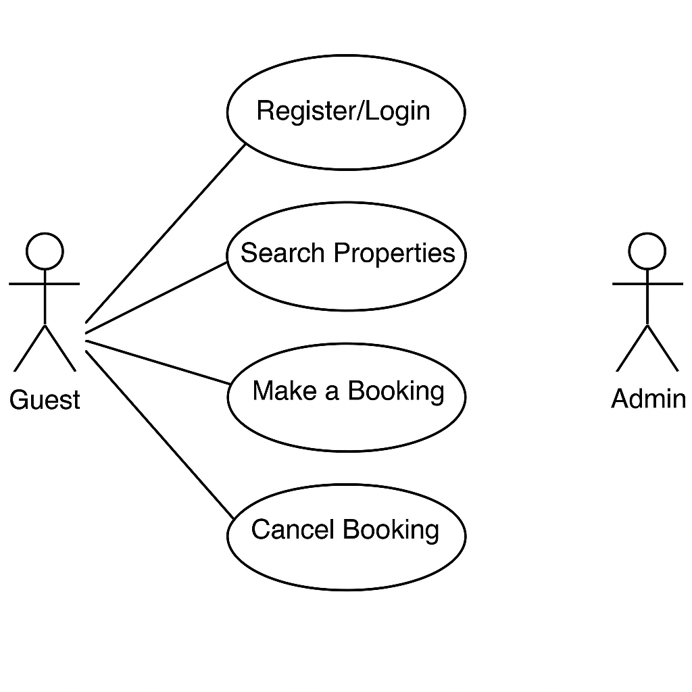

# Requirement Analysis in Software Development

This repository is part of my learning journey in Requirement Analysis, focused on understanding how to effectively define and structure the foundation of a software project. It includes practical exercises, notes, and templates that illustrate key concepts such as project scope, stakeholder needs, requirement elicitation, documentation, and validation. The goal is to build a solid project footprint that aligns development with real user and business needs.

# What is Requirement Analysis?
Requirement Analysis is the process of understanding what a software project should do. It involves talking to stakeholders (like clients, users, and team members) to find out what they need from the system and what problems the software should solve.

What’s your budget?
That’s exactly what Requirement Analysis is — asking the right questions before writing any code.

# Why is Requirement Analysis Important?
Requirement Analysis is one of the first and most important steps in the Software Development Life Cycle (SDLC). Here's why:

1.  Helps Define the Project Scope
It clearly outlines what the software will do and what it won’t do. This helps keep the project focused and avoids unnecessary work (also known as scope creep).

2.  Improves Communication
It ensures everyone is on the same page — developers, designers, testers, and clients. Good communication leads to better teamwork and fewer misunderstandings.

3. Saves Time and Money
By knowing what to build early on, the team can avoid rework, delays, and wasted resources. It’s much cheaper to fix a misunderstanding during planning than after the app is built.

4.  Guides Design and Development
The requirements act as a blueprint for the developers. It helps them know what features to build, what data to collect, and how the system should behave.

5. ✔ Ensures Quality and User Satisfaction
When the software meets the real needs of the users, they are more likely to be satisfied. Requirement Analysis helps ensure the product is useful, usable, and valuable.

# Key Activities in Requirement Analysis.

Understanding user needs and turning them into clear, actionable software requirements involves several important steps. Below are the five key activities in Requirement Analysis:

- Requirement Gathering

  - Identify and collect information from stakeholders.

  - Understand business goals and user needs.

  - Use interviews, surveys, and existing documents.

- Requirement Elicitation

  - Explore and clarify gathered information.

  - Discover hidden or unstated needs.

  - Use techniques like workshops, brainstorming, and observations.

- Requirement Documentation

  - Clearly write down all requirements.

  - Create documents like Software Requirement Specifications (SRS) or user stories.

  - Provide a reference for the entire development team.

- Requirement Analysis and Modeling

  - Analyze requirements for clarity, completeness, and feasibility.

  - Organize and structure the information logically.

  - Use visual models (e.g., flowcharts, UML diagrams) to represent the system.

- Requirement Validation

  - Review requirements with stakeholders for approval.

  - Ensure all requirements are correct and agreed upon.

  - Catch issues early before development begins.

# Types of Requirements
In software development, requirements are generally divided into two categories: Functional and Non-functional. Both are essential for building a system that works well and meets user expectations.

# Functional Requirements
Functional requirements describe what the system should do — the specific features, functions, and behaviors of the system. They define how the system responds to inputs and what it should output.

Examples for a Booking Management Project:

- Users can register and log in to the system.

- Users can search for available properties by date and location.

- The system should allow users to make, cancel, or reschedule bookings.

- Admins can add, edit, or remove listings.

- The system should send confirmation emails after a booking is made.

# Non-functional Requirements
Non-functional requirements describe how the system should perform — they define the system’s quality attributes such as performance, security, and usability. These don't add features, but they ensure the system works well under different conditions.

Examples for a Booking Management Project:

- The system should load search results within 2 seconds.

- The website should be available 99.9% of the time (high availability).

- Passwords must be encrypted and stored securely.

- The system should support up to 10,000 concurrent users.

- The platform must be mobile-friendly and responsive on all devices.

# Use Case Diagrams
Use Case Diagrams are a visual tool used during Requirement Analysis to show how users (actors) interact with a system. They help capture the functional requirements by showing the major actions users can perform and how the system responds.

# Benefits of Use Case Diagrams
 - Help communicate user expectations clearly.

 - Provide a visual summary of system functionality.

 - Make it easier to identify user roles and responsibilities.

 - Improve collaboration between developers, designers, and stakeholders.

# Use Case Diagram for Booking Management System
The diagram below shows key interactions between users (e.g., Guests and Admins) and the booking system.

Actors:
 - Guest (regular user)
 - Admin

Use Cases:
  - Register/Login

  - Search Properties

  - Make a Booking

  - Cancel Booking

  - Receive Confirmation

  - Manage Listings (Admin)

  - View Bookings (Admin)

# Acceptance Criteria
Acceptance Criteria are conditions that a feature or functionality must meet to be accepted by stakeholders, testers, or product owners. They serve as a checklist that ensures a feature behaves as expected and is complete.

# Importance of Acceptance Criteria
 - Define clear and measurable expectations for a feature.

 - Help developers, designers, and QA testers stay aligned.

 - Reduce miscommunication between stakeholders and the development team.

 - Ensure a smooth and accurate testing and approval process.

Example: Acceptance Criteria for “Checkout” Feature
Feature: Allow users to complete a property booking through the checkout process.

Acceptance Criteria:

 - The user must be logged in to proceed to checkout.

 - The checkout page must display booking details (e.g., property name, date, total price).

 - The user can enter or select payment details.

 - A valid payment must be confirmed before booking is finalized.

 - A confirmation email is sent to the user after a successful booking.

 - If payment fails, an error message is shown and the booking is not saved.
